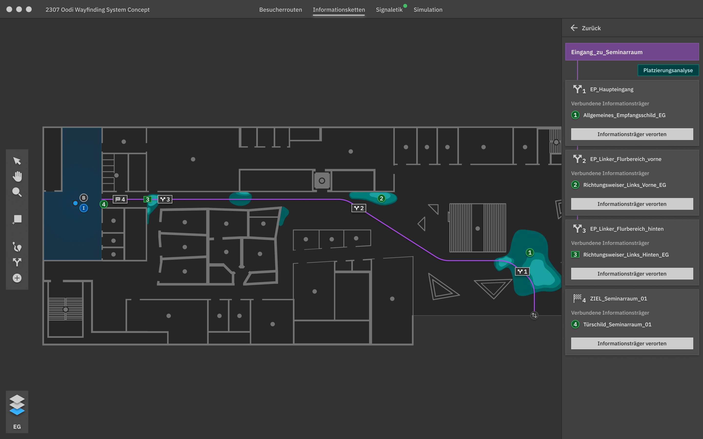



<header class="header-hero header">
    
    

        <h1 class="heading-hero">The first spatial aware signage development environment</h1>
        
You’re working with signage and wayfinding systems? 

        <button class="button button-black" onclick="toggleChat()">Let's Chat</button>
    

</header>

<section class="focus grid-3 grid-3-divider section-yellow">
    

        
        <h2 class="heading-h4">Focus 1</h2>
        
Aid designers in analyzing project sites

    

    

        
        <h2 class="heading-h4">Focus 2</h2>
        
Eliminate repetitive tasks – simplify management of signage databases?

    

    

        
        <h2 class="heading-h4">Focus 3</h2>
        
Use simulation to preview sign concepts before production?

    

</section>

<section class="vision">
    

        <h2 class="heading-h4">Vision</h2>
        
Based on the three main areas of focus, we created a vision for the Destinations application.

        <a class="button button-yellow" href="/concept">Learn about the concept</a>
    

</section>
<section class="features-collage section-yellow">
    

    

    

    

    

</section>
<section class="insert-section section-white">
    <h1 class="text-xlarge-sofia">Our core features</h1>
    <a class="button button-black" href="features.html">Get an overview</a>
</section>

<section class="feature-grid section-white grid-2 grid-2-divider">
    

        
        <h2 class="heading-h4"><a href="/features.html#Route">Route Creation</a></h2>
        
Keep track of your visitors routes.

    

    

        
        
<a href="/features.html#Database">Signage Database</a>

        
It keeps track of everythig so you don’t have to.

    

    

        
        <h2 class="heading-h4"><a href="/features.html#Placement">Signage placement</a></h2>
        
Sign placement and exploration made easy.

    

    

        
        <h2 class="heading-h4"><a href="/features.html#Simulation">Simulation</a></h2>
        
It keeps track of everythig so you don’t have to.

    

</section>

<section class="insert-section section-green">
    

        <h2 class="heading-h4">Next Up</h2>
        
This project has been chosen to be part of the goHfG founders initiative. 

    

    <a class="button button-black" href="
">Read the journal entry</a>
</section>
